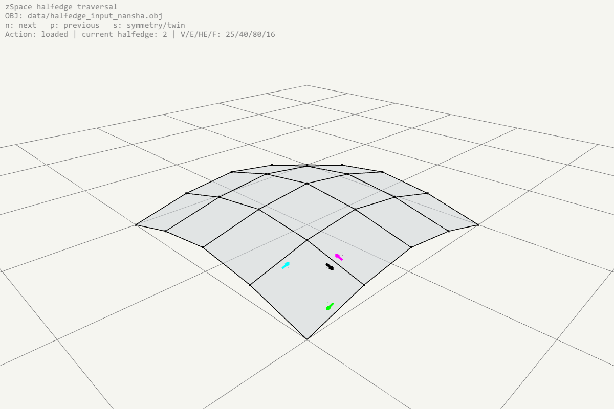

# Mesh Topology & Traversal Sketches

This document covers sketches and tutorials demonstrating mesh topology representation and traversal using the zSpace library integrated with the alice2 rendering engine.

---

## zSpace Halfedge Traversal Sketch

### Purpose
The **Halfedge Traversal Sketch** demonstrates how to load a 3D mesh via the zSpace IO API, navigate its topological structure (halfedges, adjacent faces, vertices) through keyboard inputs, and highlight the traversed halfedges using directed, proportional arrows in the viewer.

This sketch exemplifies the public API integration model:
```text
zSpace Geometry & Topology Engine  ──►  alice2 Display & Renderer Overlay
```

---

### Viewer


The screenshot shows the centered, focused viewport displaying the imported mesh. The colored arrows represent the active halfedge and its adjacent relations.

---

### Source Files
- **Sketch Source Code**: [sketch_zspace_halfedge_traversal.cpp](file:///c:/Users/vishu.b/source/repos/GitZHCODE/zspace_alice2/alice2/userSrc/zspace/topology/sketch_zspace_halfedge_traversal.cpp)
- **Default Input OBJ**: [halfedge_input_nansha.obj](file:///c:/Users/vishu.b/source/repos/GitZHCODE/zspace_alice2/alice2/data/halfedge_input_nansha.obj)

During compilation, the input data files are automatically copied to the executable directory:
```text
alice2/build_zspace/bin/Release/data/halfedge_input_nansha.obj
```

---

### zSpace API Traversal
The mesh is loaded and queried using the public function sets and object wrappers:
```cpp
zSpace::zObjectMesh m_mesh;
zSpace::zIO::readMesh(m_objPath, m_mesh);
```

To traverse the mesh, `zSpace::zItMeshHalfEdge` is used:
- **Move to Next**: `current.getNext()` (keys `n`/`N`)
- **Move to Previous**: `current.getPrev()` (keys `p`/`P`)
- **Move to Symmetric (Twin)**: `current.getSym()` (keys `s`/`S`)

The initial starting selection is chosen to be an interior halfedge so that twin traversal successfully transitions between adjacent polygons.

---

### Key Controls

| Key | Action |
|---|---|
| `n` / `N` | Advance to the **Next** halfedge in the current face loop. |
| `p` / `P` | Regress to the **Previous** halfedge in the current face loop. |
| `s` / `S` | Transition to the **Symmetric / Twin** halfedge in the adjacent face. |

---

### Display & Visualizations
The main mesh body is drawn using the standard alice2 scene draw helper:
```cpp
alice2::zDisplayMeshSetting display;
scene().draw(m_mesh, display);
```

The selected halfedges are drawn as short, **proportional directed arrows** centered on the respective edges. The arrow sizes (shaft length, head length, head width, and offsets) scale dynamically with the edge length (`len`), keeping them visually balanced regardless of the scale:
- **Arrow Shaft Length**: `len * 0.1`
- **Arrow Head Length**: `len * 0.03` (proportional to edge length)
- **Arrow Head Width**: `len * 0.02` (proportional to edge length)
- **Offset**: Displaced slightly toward the face owning the halfedge to prevent overlap.

#### Color Mapping

| Relation | Identifier | Color |
|---|---|---|
| **Current Halfedge** | `C` | Black |
| **Next Halfedge** | `N` | Cyan |
| **Previous Halfedge** | `P` | Green |
| **Symmetric / Twin Halfedge** | `S` | Magenta |

---

### Build and Run Instructions

From the `alice2` folder, execute:
```bat
build_with_zspace.bat
run_with_zspace.bat
```
The application will automatically center the geometry and output a screenshot of the viewer on startup.
